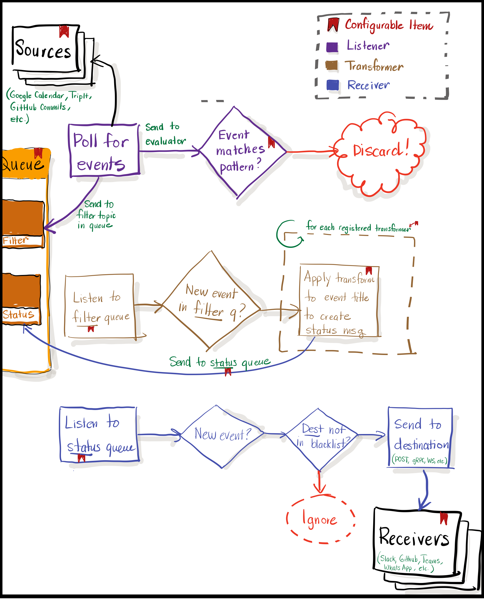

# Status

Set statuses onto any service from anywhere!

- [Getting Started](#getting-started)
- [Inspiration](#inspiration)
- [Design Goals](#design-goals)
- [Configuration File](#configuration-file)
- [Writing your own Status sources](#writing-your-own-status-sources)
- [Writing your own Status receivers](#writing-your-own-status-receivers)

## Getting Started

Install status using `go get`:

```sh
go get github.com/carlosonunez/status@v1.0.0
```

Then start `status` with a configuration file describing the events to listen to
and how to turn them into statuses:

```sh
status -f /path/to/status.yaml
```

## Inspiration

I generally have lots of things going on, but I hate leaving people waiting on
me without telling them why. I'm also incredibly lazy and hate setting status
messages on 80 billion Slack workspaces, Teams tenants, social media accounts,
and such.

I built [Slack Status Bot](https://github.com/carlosonunez/slack-status-bot) as
a rudimentary approach to posting Slack status messages from TripIt (since I
travelled all the time when I wrote it). Since this was pinned to a single Slack
tenant, this obviously didn't scale.

I wanted something that would let me set statuses onto any platform from any
source with as little code as possible. This is that thing!

## Design Goals



- Create status messages from events created by any registered source,
- Allow arbitrary, destination-aware transformations to statuses,
- Post status messages onto any destination regardless of the "language" they
  speak (HTTP, gRPC, WebSockets, SOAP, etc.)
- Be UNIX-y (be good at reading, transforming, and sending statuses; let each
  source and receiver handle things like authentication, client construction,
  etc.)

## Configuration File

See the [reference](./status.yaml.reference) to learn how to configure Status.

## Writing your own Status sources

> ⚠️  This section is still a work in progress.

## Writing your own Status receivers

> ⚠️  This section is still a work in progress.

## Contributing

- [Create an issue](https://github.com/carlosonunez/status/issues/new)
  describing the problem that you're looking to solve or feature
  you're looking to implement.
- Fork this repository
- If you're implementing a new feature, [add an end-to-end test](./tests/e2e)
  describing how its supposed to work and not work.
- Make sure that tests are passing with `make test`
- Create a pull request and link it to the issue that you created!
